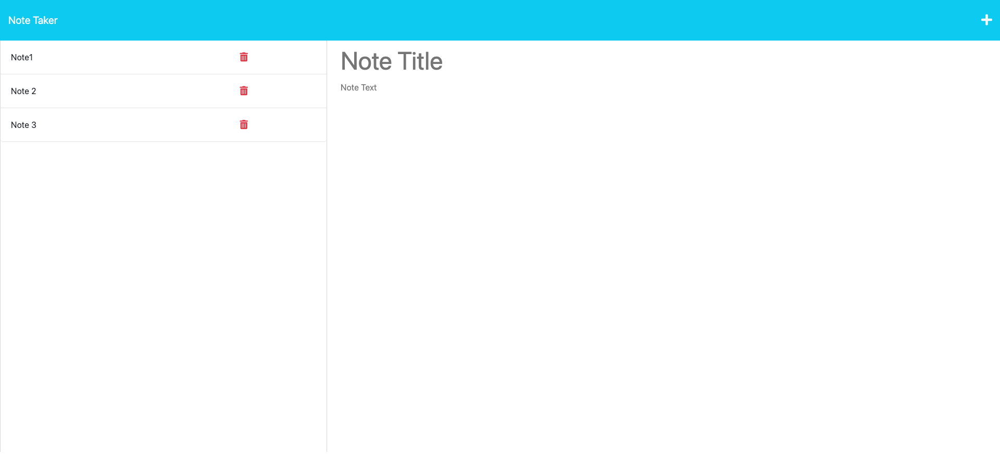

# Note Taker

## Description
This application is a note taking app. You can add and delete notes. This application used express.js and helped me solidify my understanding of routes.

## Installation
Please run npm install

## Usage
You can run node server.js or use the deployed link below.

## Contributions
Vinita Navani
  
## Questions
For any questions please email me at vinita.navani@gmail.com or visit my Github page at [vini3076](https://github.com/vini3076).

## Screenshot

## Links

[Deployed link](https://note-taker-vn-6ebf1fab3cae.herokuapp.com/notes)
 
[Github repository](https://github.com/vini3076/Note-Taker)

## Credits
 - Tutor: Aaron Centeno

